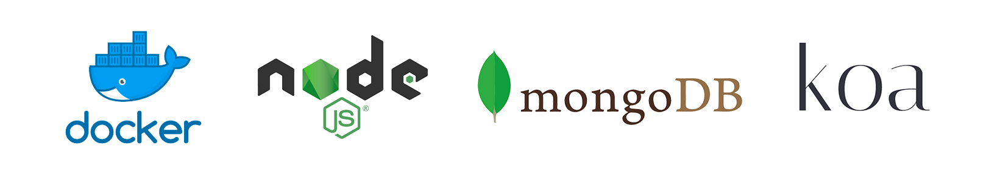
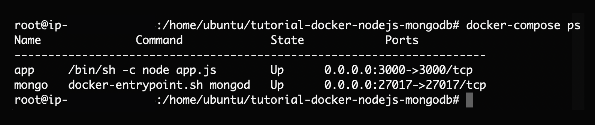

# Tutorial Docker with NodeJS, MongoDB and koa [](https://github.com/RichardLitt/standard-readme)

🔬 Create your first Docker container with NodeJS, MongoDB and koa



## Installation

```bash
docker-compose build
```

## Run

```bash
docker-compose up
```

## Usage

```bash
docker-compose ps
```



Open: http://localhost:3000 

## More Info

[Docker](https://docs.docker.com/) \
[HUB Docker](https://hub.docker.com/_/node/) \
[NodeJS](https://nodejs.org/es/) \
[MongoDB](https://www.mongodb.com/) \
[koa](https://koajs.com/)

## Maintainers

 \
[@JoseJPR](https://github.com/JoseJPR)

## Contact

🎓 Linkedin: https://www.linkedin.com/in/josejpr/ \
🐦 Twitter: https://twitter.com/JoseJ_PR \
📧 Send email to: me@josejpr.com

## License
[MIT](LICENSE.md)

## Happy Code

Created with JavaScript, lot of ❤️ and a few 🍺

#### This README.md file has been written keeping in mind:
- [GitHub Markdown](https://guides.github.com/features/mastering-markdown/)
- [Emoji Cheat Sheet](https://www.webfx.com/tools/emoji-cheat-sheet/)